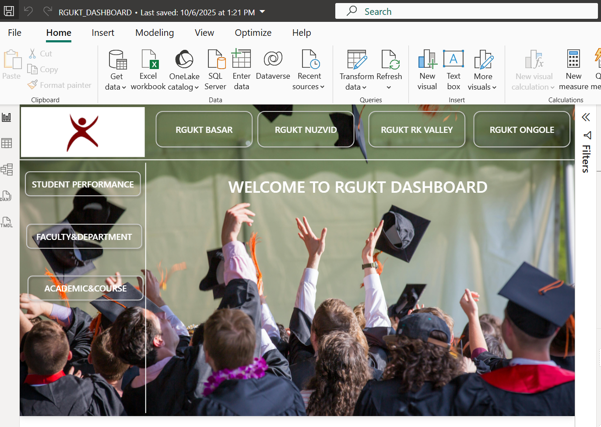
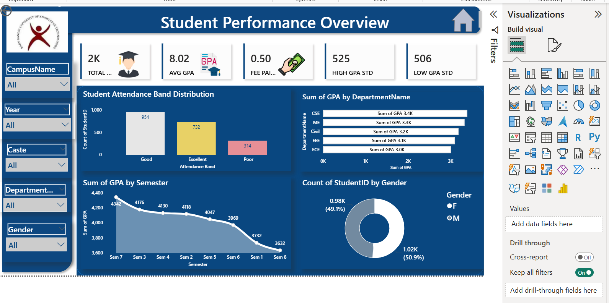
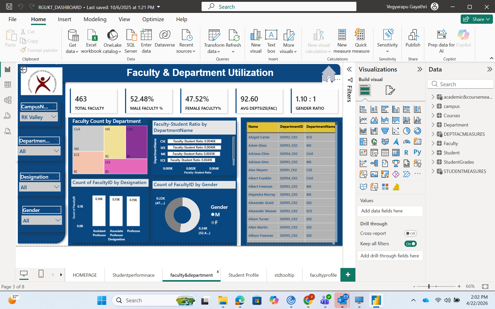
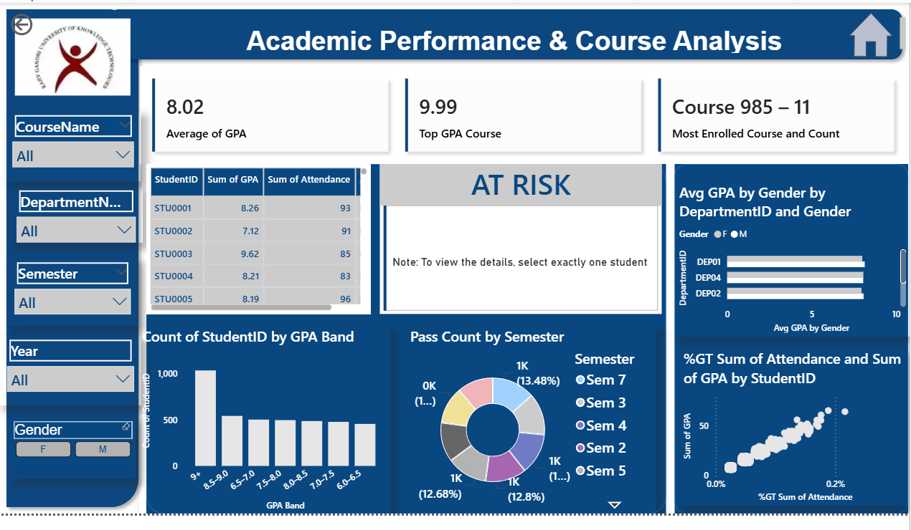
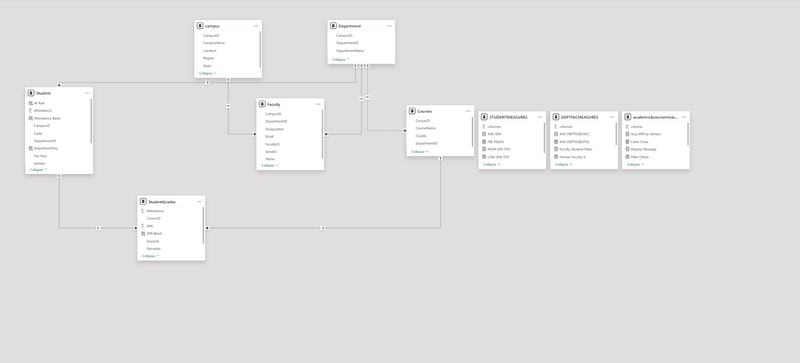

# Academic Performance & Faculty Analytics Dashboard – RGUKT (Multi-Campus)

## 📌 Overview
This project presents an interactive Power BI dashboard for analyzing student performance, course trends, and faculty utilization across multiple campuses. It enables data-driven insights into academic outcomes and resource distribution.

## 📊 Key Features
- Built a multi-table data model (Student, Faculty, Courses, Department, Campus, StudentGrades)
- Developed DAX measures using CALCULATE, AVERAGEX, and TOPN
- Performed GPA analysis and department-wise performance tracking
- Conducted course-level analysis (Top GPA course, Most enrolled course)
- Implemented dynamic filtering using slicers
- Applied user-driven logic (selection validation and dynamic messaging)
- Applied conditional formatting for dynamic visual behavior
- Integrated web URL navigation for external feedback

## 📷 Dashboard Screenshots

### Homepage

Landing page with campus navigation and overview.

### Student Performance

GPA trends, attendance bands, and gender distribution.

### Faculty Dashboard

Faculty count, gender ratio, and department utilization.

### Course & Risk Analysis

Top courses, pass counts, and at-risk student identification.

### Data Model

Star schema with relationships across Student, Faculty, Courses, and Department.

---

## 🧠 Sample DAX Measures

### Average Department Size (Faculty)
```DAX
AVG DEPTSIZE(FAC) = 
AVERAGEX(
    VALUES(Department[DepartmentID]),
    CALCULATE(COUNTROWS(Faculty))
)
```

### Most Enrolled Course

```DAX
Most Enrolled Course and Count = 
VAR TopCourseTable =
    TOPN(
        1,
        SUMMARIZE(
            StudentGrades,
            Courses[CourseName],
            "Enrollments", COUNT(StudentGrades[StudentID])
        ),
        [Enrollments], DESC
    )
VAR CourseName = MAXX(TopCourseTable, Courses[CourseName])
VAR Enrollments = MAXX(TopCourseTable, [Enrollments])
RETURN
    CourseName & " – " & Enrollments
```

### Filter Validation Logic
```DAX
Filter Check = 
CALCULATE(DISTINCTCOUNT(Student[StudentID]), ALLSELECTED(Student))

Display Message = 
IF([Filter Check] <> 1, 
"Note: Select exactly one student", 
"")

Color Code = 
IF([Filter Check] = 1, "#FFFFFF00", "#FFFFFF")

```
## 🛠 Tools Used
- Power BI  
- DAX  
- Data Modeling

## 🚀 Key Insights
- Identified high and low GPA student groups  
- Analyzed course performance and enrollments  
- Evaluated faculty-student ratio across departments  
- Compared performance across campuses

## 📁 Files
- [RGUKT_DASHBOARD.pbix](RGUKT_DASHBOARD.pbix) – Power BI report file

## ⚠️ Note
This project is created for learning and portfolio purposes.


